# aws-multi-vpc-privatelink
Secure multi-VPC AWS architecture using PrivateLink, Interface Endpoints, an internal NLB, and private EC2 services.

# AWS Multi-VPC PrivateLink Architecture

---

## 3.1 Project Overview

### Overview of Project

---

### Scenario

A growing fintech company runs multiple internal systems:

- **Payments** — Handles customer transactions
- **Analytics** — Runs reports and business insights
- **Shared Services** — Hosts internal APIs used by other teams

For security and compliance, each system lives in its **own VPC**.

However, the Payments and Analytics teams still need to call shared internal APIs without:

- Exposing anything to the public internet
- Managing complex VPC peering meshes
- Opening SSH or public endpoints to backend services

The company wants a **clean, private-only connectivity model** where shared services are consumed through **AWS PrivateLink** and internal traffic remains within the AWS network.

---

### My Role as the Cloud Engineer

In this project, I will design and implement a **multi-VPC AWS architecture** where:

- Each application is isolated inside its own **VPC and subnets**
- A **Shared Services VPC** hosts a private internal web application
- The **Payments** and **Analytics** VPCs consume the application through **AWS PrivateLink**
- No public IP addresses or direct internet access are required for internal application traffic
- **Security Groups** and network configuration enforce **least-privilege access**

This architecture demonstrates how enterprises can securely expose internal platform services to other teams while maintaining strong network isolation.

---

### Our Solution

The environment will contain **three VPCs**:

1. **Payments VPC**
2. **Analytics VPC**
3. **Shared Services VPC**

The Shared Services VPC will host a private internal web application.

The application will be exposed through an **internal Network Load Balancer (NLB)** and an **AWS PrivateLink VPC Endpoint Service**.

The Payments and Analytics VPCs will connect to the shared service using **Interface VPC Endpoints**.

This allows both client VPCs to access the service privately without requiring:

- VPC Peering
- NAT Gateways for application traffic
- Internet Gateways for application traffic
- Public IP addresses
- Public-facing backend services

---

## About the Project

In this hands-on project, I will:

- Create **three isolated VPCs** with public and private subnets
- Create **Security Groups** for the Shared Services application and client VPCs
- Deploy a **private-only EC2 instance** running an internal web application
- Place the application behind an **internal Network Load Balancer**
- Create a **VPC Endpoint Service** for the Network Load Balancer
- Create **Interface Endpoints** in the Payments and Analytics VPCs
- Approve PrivateLink endpoint connections
- Test private-only connectivity between the client VPCs and the Shared Services application

By the end of the project, the environment will demonstrate a **production-style multi-VPC PrivateLink architecture** used to securely share internal services across isolated networks.

---

## Steps To Be Performed 👩‍💻

The project will be completed through the following major steps:

1. Build three isolated VPCs:
   - Payments
   - Analytics
   - Shared Services

2. Configure subnets, routing, and network components

3. Create Security Groups for:
   - Shared Services application
   - Payments client
   - Analytics client

4. Deploy the **Shared Services internal web application** on a private EC2 instance

5. Place the application behind an **internal Network Load Balancer**

6. Create an **AWS PrivateLink VPC Endpoint Service**

7. Create **Interface Endpoints** in:
   - Payments VPC
   - Analytics VPC

8. Approve endpoint connections

9. Test **private-only access** to the internal service

---

## Services Used 🛠

| AWS Service | Purpose |
|---|---|
| **Amazon VPC** | Provides isolated networks for Payments, Analytics, and Shared Services |
| **Subnets** | Separates resources into different network segments |
| **Route Tables** | Controls traffic flow within each VPC |
| **Internet Gateways** | Provides internet connectivity where required |
| **Amazon EC2** | Hosts the private internal web application |
| **Security Groups** | Provides stateful network access control |
| **Network Load Balancer (NLB)** | Distributes traffic to the internal application |
| **AWS PrivateLink** | Provides private service connectivity between VPCs |
| **VPC Endpoint Service** | Exposes the Shared Services application through PrivateLink |
| **Interface VPC Endpoints** | Allows Payments and Analytics to privately consume the shared service |

---

## Architectural Diagram

The following diagram represents the planned architecture:

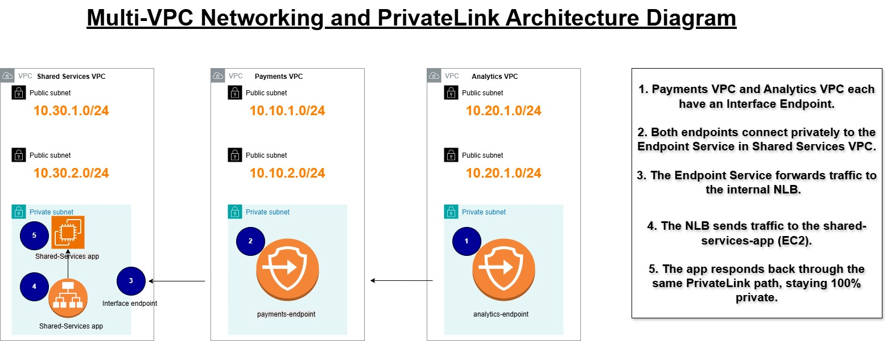

---

## Final Result

At the end of this project, the environment will include:

- **Three isolated VPCs**
  - Payments
  - Analytics
  - Shared Services

- A private internal service hosted inside the **Shared Services VPC**

- An application that is **not directly exposed to the public internet**

- An **internal Network Load Balancer**

- An **AWS PrivateLink Endpoint Service**

- **Interface Endpoints** inside the Payments and Analytics VPCs

- Working private connectivity between the client VPCs and the Shared Services application

- A real-world example of how enterprises securely share internal APIs across isolated AWS environments


---

## Key Security Concepts Demonstrated

This project demonstrates several important cloud security concepts:

- **Network segmentation**
- **Private service connectivity**
- **Least-privilege network access**
- **VPC isolation**
- **Reduction of public attack surface**
- **AWS PrivateLink**
- **Interface VPC Endpoints**
- **Internal load balancing**
- **Secure cross-VPC service consumption**

---

## 3.2 Build and Configure All Three VPCs

Before configuring AWS PrivateLink, I first built the network foundation for the environment.

For this stage of the project, I created three isolated VPCs:

- **Payments VPC**
- **Analytics VPC**
- **Shared Services VPC**

Each VPC contains its own subnets, route tables, and networking components.

This provides separation between the different environments and prepares the infrastructure for PrivateLink connectivity later in the project.

---

## Step 1: Create the Payments VPC

The first environment I created was the **Payments VPC**.

### Payments VPC Configuration

- **VPC Name:** `payments-vpc`
- **IPv4 CIDR:** `10.10.0.0/16`

I created the VPC manually so I could configure each networking component individually.

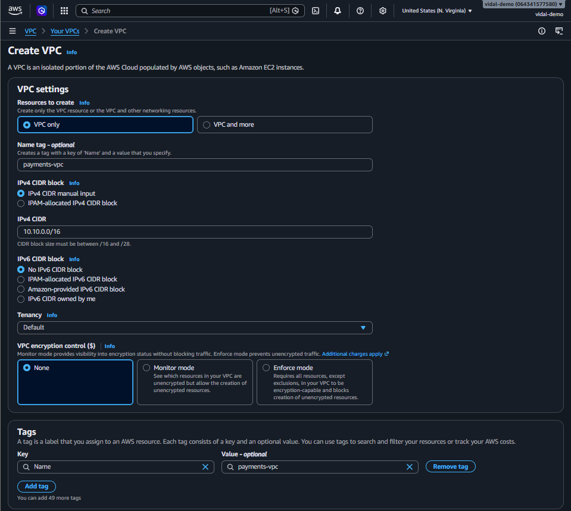

---

### Payments Subnets

Inside the Payments VPC, I created one public subnet and two private subnets.

| Subnet | CIDR |
|---|---|
| `payments-public-subnet-1` | `10.10.1.0/24` |
| `payments-private-subnet-1` | `10.10.2.0/24` |
| `payments-private-subnet-2` | `10.10.3.0/24` |

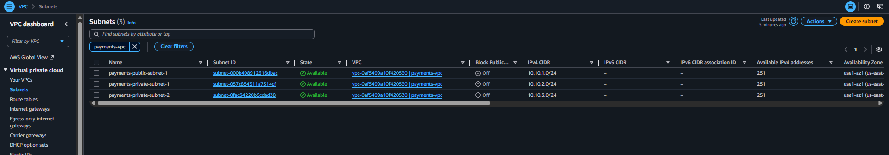

---
### Payments Route Table Setup

I created a dedicated public route table named:

`payments-public-rt`

The public subnet was associated with this route table.

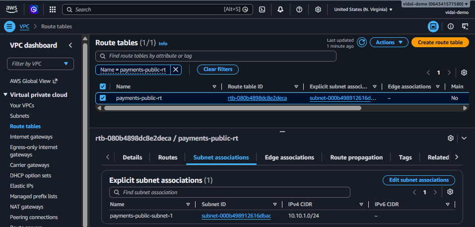

---

### Payments Internet Gateway

I created:

`payments-igw`

and attached it to:

`payments-vpc`

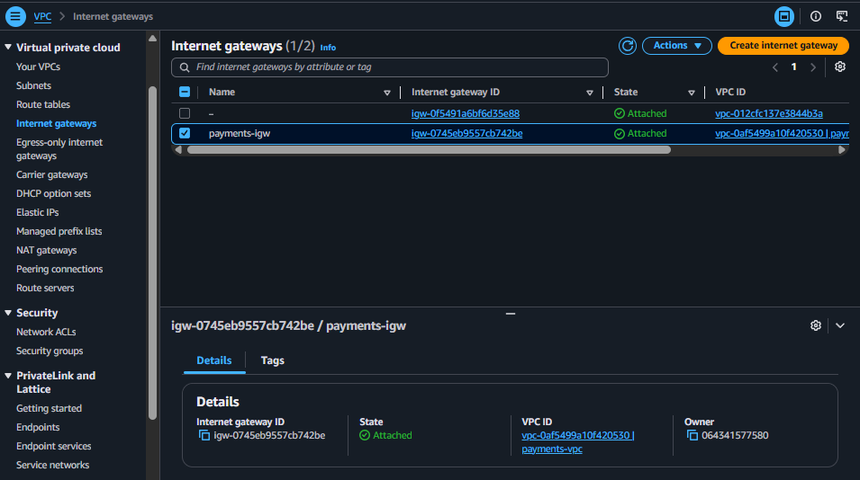

---

### Payments Public Route

After attaching the Internet Gateway, I added the following routes to `payments-public-rt`:

| Destination | Target |
|---|---|
| `10.10.0.0/16` | `local` |
| `0.0.0.0/0` | `payments-igw` |

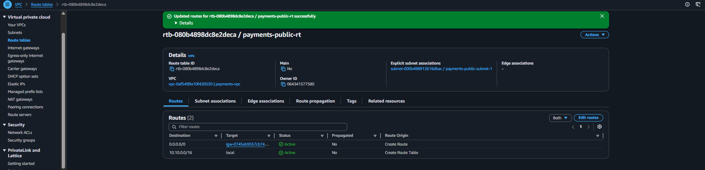

---

At this point, the **Payments VPC network configuration was complete**.

---
---

## Step 2: Create the Analytics VPC

Next, I created the **Analytics VPC**.

### Analytics VPC Configuration

- **VPC Name:** `analytics-vpc`
- **IPv4 CIDR:** `10.20.0.0/16`

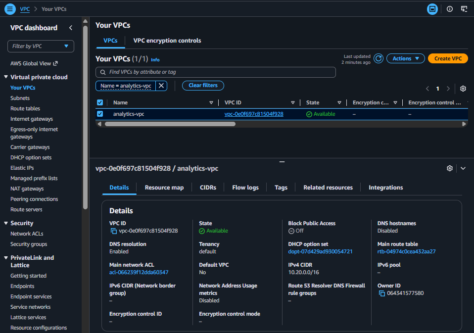

---

### Analytics Subnets

I created one public subnet and two private subnets.

| Subnet | CIDR |
|---|---|
| `analytics-public-subnet-1` | `10.20.1.0/24` |
| `analytics-private-subnet-1` | `10.20.2.0/24` |
| `analytics-private-subnet-2` | `10.20.3.0/24` |

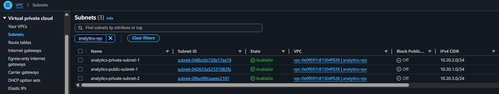

---

### Analytics Route Table Setup

I created a dedicated public route table named:

`analytics-public-rt`

The public subnet was associated with this route table.

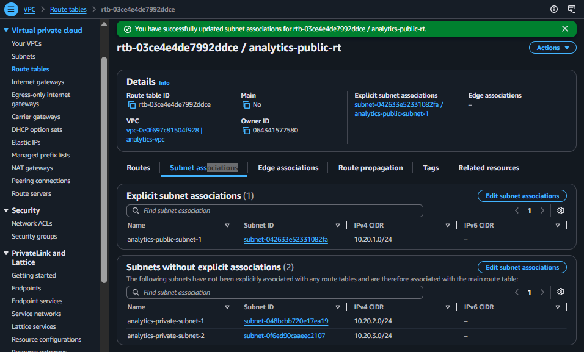

---

### Analytics Internet Gateway

I created:

`analytics-igw`

and attached it to:

`analytics-vpc`

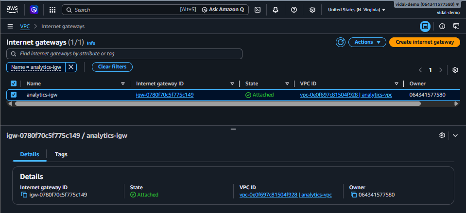

---

### Analytics Public Route

After attaching the Internet Gateway, I added the following default route to `analytics-public-rt`:

| Destination | Target |
|---|---|
| `0.0.0.0/0` | `analytics-igw` |
| `10.20.0.0/16` | `local` |

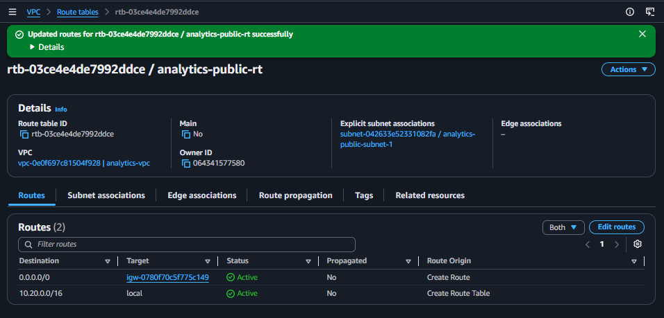

---

## Step 3: Create the Shared Services VPC

The **Shared Services VPC** will host the internal application and later provide the AWS PrivateLink Endpoint Service.

### Shared Services VPC Configuration

- **VPC Name:** `shared-services-vpc`
- **IPv4 CIDR:** `10.30.0.0/16`

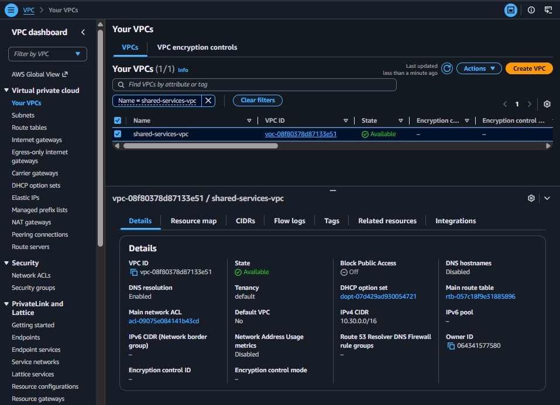

---

### Shared Services Subnets

I created one public subnet and two private subnets.

| Subnet | CIDR |
|---|---|
| `shared-public-subnet-1` | `10.30.1.0/24` |
| `shared-private-subnet-1` | `10.30.2.0/24` |
| `shared-private-subnet-2` | `10.30.3.0/24` |

The private subnets were placed in separate Availability Zones.

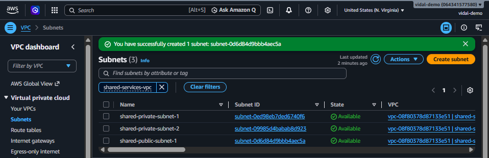

---

### Shared Services Route Table Setup

I created a dedicated public route table named:

`shared-public-rt`

The public subnet was associated with this route table.

**Screenshot:** `shared-public-subnet-association.png`

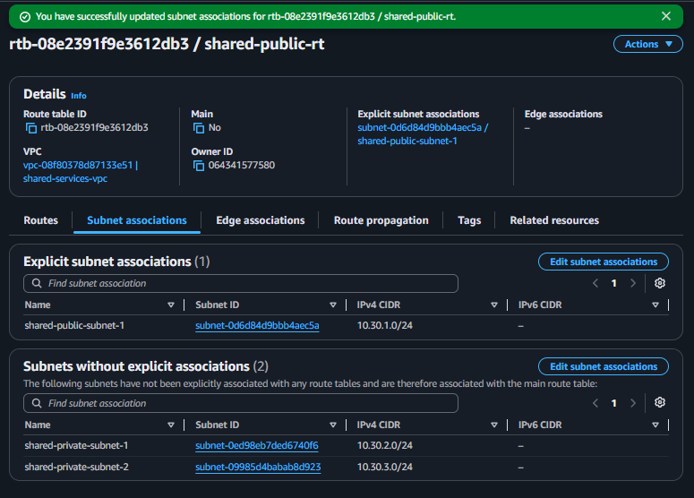

---

### Shared Services Internet Gateway

I created:

`shared-igw`

and attached it to:

`shared-services-vpc`

**Screenshot:** `shared-services-internet-gateway.png`

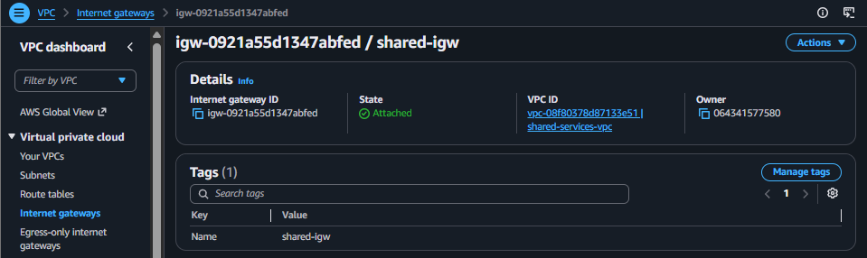

---

### Shared Services Public Route

After attaching the Internet Gateway, I added the following routes to `shared-public-rt`:

| Destination | Target |
|---|---|
| `10.30.0.0/16` | `local` |
| `0.0.0.0/0` | `shared-igw` |

**Screenshot:** `shared-services-public-route-table.png`

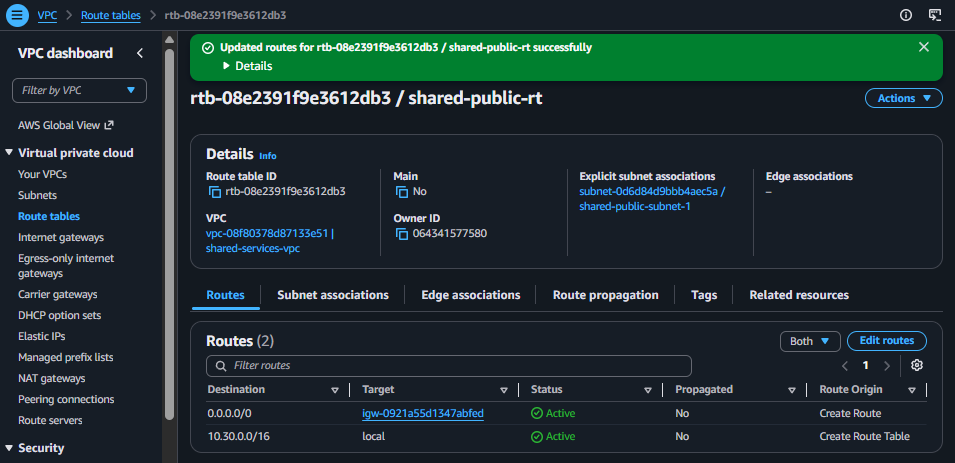

---

At this point, the **Shared Services VPC network configuration was complete**.

---
## Step 4: Configure Security Groups

After building the VPCs, I created dedicated Security Groups for each environment.

| Security Group | VPC | Purpose |
|---|---|---|
| `shared-app-sg` | Shared Services VPC | Protects the internal application |
| `payments-client-sg` | Payments VPC | Protects Payments client resources |
| `analytics-client-sg` | Analytics VPC | Protects Analytics client resources |

---

### Shared Services Application Security Group

- **Security Group:** `shared-app-sg`
- **VPC:** `shared-services-vpc`
- **Port:** `80`
- **Protocol:** HTTP
- **Source:** `10.0.0.0/8`

**Screenshot:** `shared-app-security-group.png`

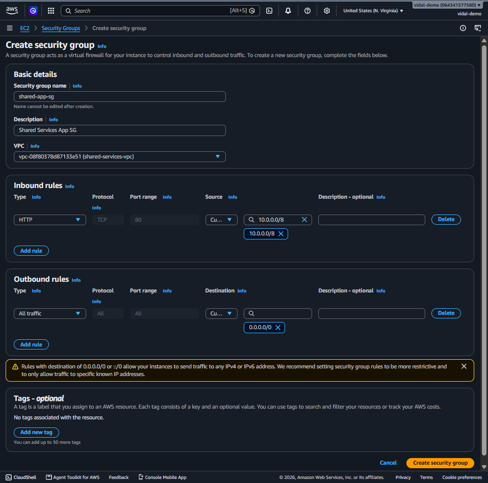

---

### Payments Client Security Group

- **Security Group:** `payments-client-sg`
- **VPC:** `payments-vpc`

**Screenshot:** `payments-client-security-group.png`

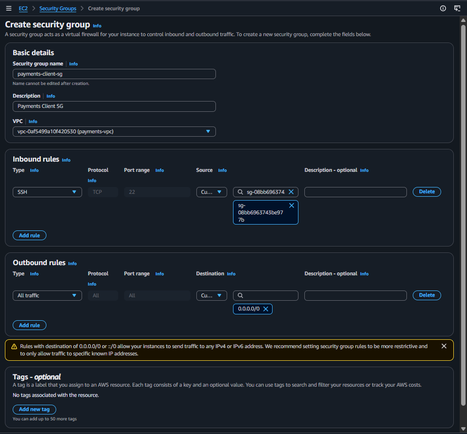

---

### Analytics Client Security Group

- **Security Group:** `analytics-client-sg`
- **VPC:** `analytics-vpc`

**Screenshot:** `analytics-client-security-group.png`

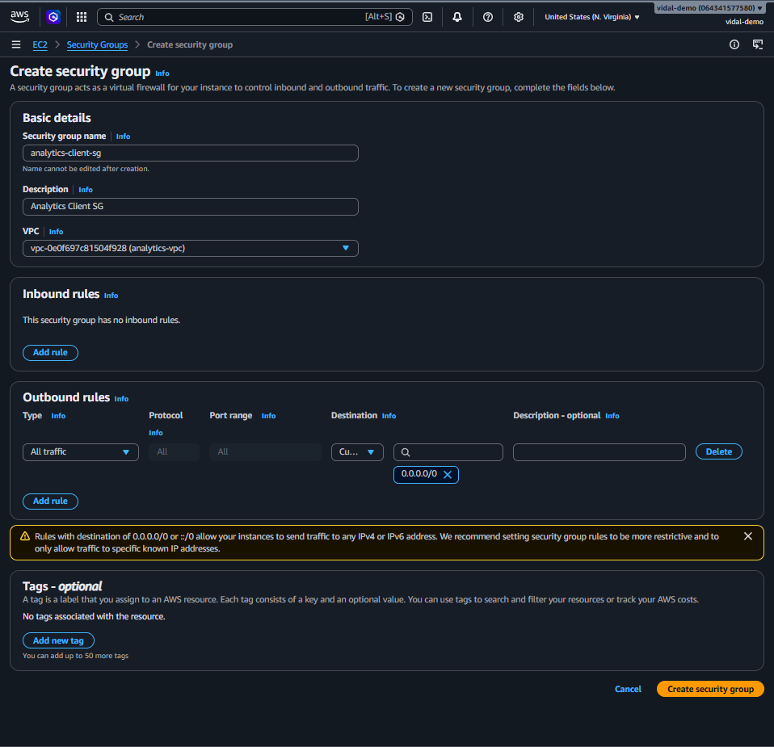

---

## Network Configuration Summary

At the end of this stage, all three VPC environments were successfully created and configured.

| VPC | CIDR | Public Subnet | Private Subnets |
|---|---|---|---|
| **Payments** | `10.10.0.0/16` | `10.10.1.0/24` | `10.10.2.0/24`, `10.10.3.0/24` |
| **Analytics** | `10.20.0.0/16` | `10.20.1.0/24` | `10.20.2.0/24`, `10.20.3.0/24` |
| **Shared Services** | `10.30.0.0/16` | `10.30.1.0/24` | `10.30.2.0/24`, `10.30.3.0/24` |

This networking foundation prepares the environment for the **AWS PrivateLink configuration** in the next stage.

---

# 3.3 Deploy the Internal Service in the Shared Services VPC

In this section, I deployed the private internal application that will later be accessed by the **Payments** and **Analytics** VPCs through AWS PrivateLink.

The application runs on a private EC2 instance inside the **Shared Services VPC** and is configured automatically using EC2 User Data.

The goal of this section is to:

- Deploy the internal web application
- Keep the EC2 instance private
- Install and configure Apache automatically
- Serve the application on port `80`
- Prepare the service for the internal NLB and PrivateLink configuration

---

## Step 1: Launch the EC2 Instance

I created an EC2 instance to host the internal Shared Services application.

### EC2 Configuration

- **Instance Name:** `shared-services-app`
- **AMI:** Amazon Linux 2023
- **Instance Type:** `t2.micro` or `t3.micro`

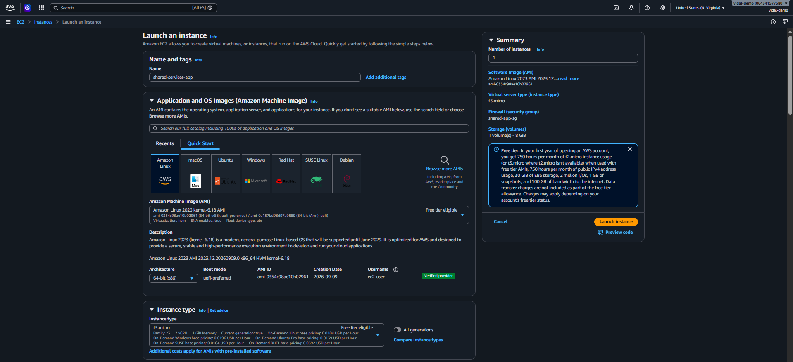

---

### Network Configuration

I placed the EC2 instance inside the private subnet of the Shared Services VPC.

- **VPC:** `shared-services-vpc`
- **Subnet:** `shared-private-subnet-1`
- **Auto-assign Public IP:** Disabled
- **Security Group:** `shared-app-sg`

The instance does not receive a public IP address, which prevents the application from being directly exposed to the internet.

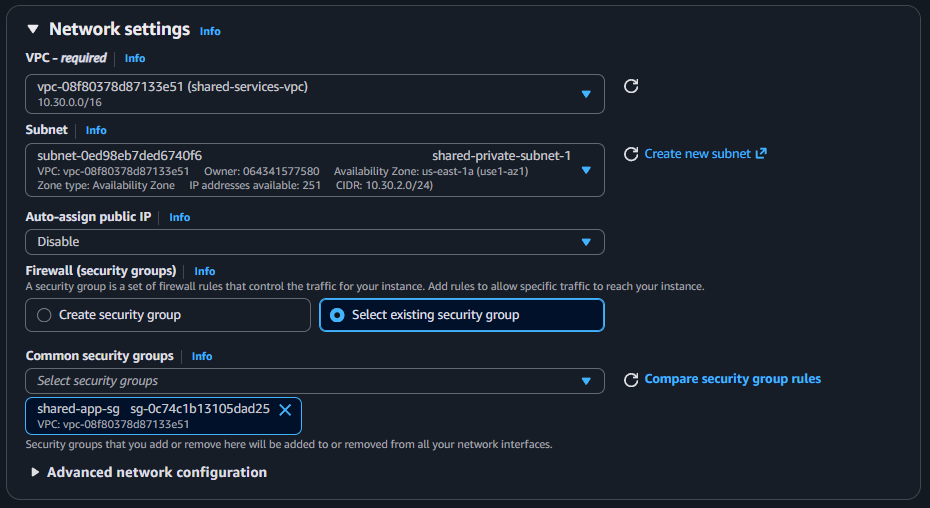

---

### User Data Configuration

I used **EC2 User Data** to automatically install and configure the internal application when the instance starts.

The script:

- Updates the operating system
- Installs Apache (`httpd`)
- Enables Apache to start automatically
- Starts the Apache service
- Creates the internal HTML application
- Stores the application at `/var/www/html/index.html`

```bash
#!/bin/bash
yum update -y
yum install -y httpd
systemctl enable httpd
systemctl start httpd

cat > /var/www/html/index.html << 'EOF'
<!DOCTYPE html>
<html>
<head>
  <meta charset="UTF-8">
  <title>Shared Services - Internal API</title>
  <style>
    body {
      font-family: Arial, sans-serif;
      background: #0f172a;
      color: #e5e7eb;
      display: flex;
      flex-direction: column;
      justify-content: center;
      align-items: center;
      min-height: 100vh;
      margin: 0;
    }

    .card {
      background: #020617;
      padding: 24px 32px;
      border-radius: 16px;
      box-shadow: 0 10px 25px rgba(0,0,0,0.5);
      max-width: 480px;
      text-align: center;
    }

    h1 {
      margin-top: 0;
      margin-bottom: 8px;
      font-size: 24px;
    }

    .tag {
      display: inline-block;
      padding: 4px 10px;
      border-radius: 999px;
      font-size: 12px;
      border: 1px solid #38bdf8;
      margin-bottom: 16px;
      text-transform: uppercase;
      letter-spacing: 0.08em;
    }

    pre {
      text-align: left;
      background: #020617;
      padding: 12px;
      border-radius: 8px;
      overflow-x: auto;
      font-size: 12px;
      border: 1px solid #1e293b;
    }
  </style>
</head>

<body>
  <div class="card">
    <div class="tag">Shared Services VPC</div>
    <h1>PrivateLink Internal Service</h1>

    <p>
      This internal API is only reachable from approved VPCs via AWS PrivateLink.
    </p>

    <pre>{
  "service": "shared-services-app",
  "vpc": "shared-services-vpc",
  "status": "healthy",
  "access": "private-only"
}</pre>
  </div>
</body>
</html>
EOF
```

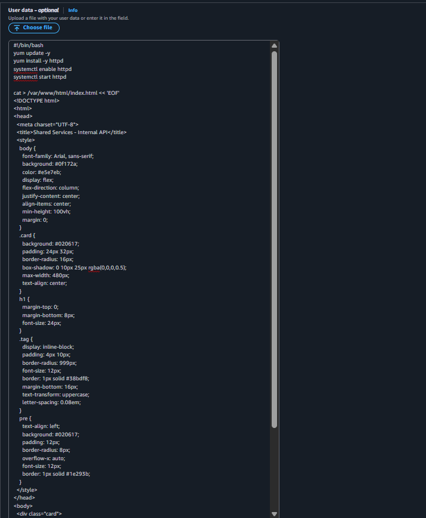

---

### What Happens When the Instance Boots

When the EC2 instance starts, the User Data script automatically:

1. Installs Apache
2. Enables the Apache service
3. Starts the web server
4. Creates `/var/www/html/index.html`
5. Serves the internal application on port `80`

No manual login is required.

The application flow at this stage is:

```text
shared-services-app
        |
        v
Apache (httpd)
        |
        v
TCP Port 80
        |
        v
/var/www/html/index.html
```

---

## Step 2: Give the Instance Time to Initialize

After launching the instance, I waited for the EC2 initialization process and User Data script to finish.

I confirmed:

- **Instance State:** Running
- **Status Checks:** `3/3 checks passed`
- **Public IPv4 Address:** None
- **Application Port:** `80`

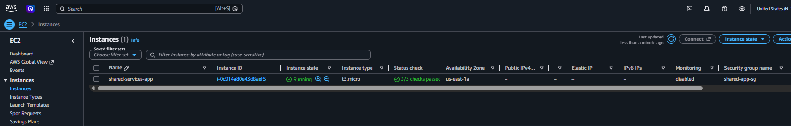

At this point, the application is running internally on the EC2 instance.

Because the instance is private and has no public IP address, the application is not directly accessible from my local computer.

The application will later be validated through the **internal Network Load Balancer** and **AWS PrivateLink**.

---

## Step 3: What This Internal Service Represents

This web application represents a private internal service that could exist inside a real enterprise environment.

Examples include:

- **Billing service**
- **Authentication or identity service**
- **Logging ingestion API**
- **Metrics service**
- **Central configuration service**
- **Internal platform API**

These types of services may need to be used by multiple teams while remaining inaccessible from the public internet.

For this project, the service will:

- Have no public IP address
- Run inside a private subnet
- Never be accessed directly from the internet
- Sit behind an internal Network Load Balancer
- Be exposed through an AWS PrivateLink Endpoint Service
- Be consumed through Interface Endpoints

---

## Step 4: Why I Don't Log In Directly

I intentionally do not use SSH to access the Shared Services application.

The EC2 instance:

- Runs inside a **private subnet**
- Has **no public IP**
- Does not require SSH for deployment
- Does not require EC2 Instance Connect
- Does not require a bastion host
- Is configured automatically through EC2 User Data

Instead of connecting directly to the server, the service will later be verified through the intended private network path:

```text
Payments / Analytics
        |
        v
Interface Endpoints
        |
        v
AWS PrivateLink
        |
        v
Endpoint Service
        |
        v
Internal NLB
        |
        v
shared-services-app
        |
        v
Apache :80
```

This keeps the backend service private while still allowing approved VPCs to access it.

---

## Expected Result

At the end of this section:

- `shared-services-app` is running
- The instance is inside `shared-private-subnet-1`
- No public IP is assigned
- `shared-app-sg` is attached
- Apache is installed
- Apache starts automatically
- `/var/www/html/index.html` is created
- The application listens on port `80`
- EC2 status checks are passing
- The private application is ready to be placed behind an internal Network Load Balancer

---

## Next: 3.4 Set Up the PrivateLink Provider

The next section will:

1. Create the `shared-services-tg` Target Group
2. Register `shared-services-app`
3. Create the internal `shared-services-nlb`
4. Forward TCP port `80` to the application
5. Create the AWS PrivateLink Endpoint Service
6. Copy the PrivateLink Service Name

---

# 3.4 Set Up the PrivateLink Provider

With the internal application running privately inside the **Shared Services VPC**, I configured the provider side of AWS PrivateLink.

AWS PrivateLink separates connectivity into two sides:

- **Provider side** — Hosts and exposes the private service
- **Consumer side** — Connects to and consumes the private service

In this section, the **Shared Services VPC** acts as the provider.

The goal is to:

- Create a Target Group for the private EC2 application
- Register `shared-services-app` as a backend target
- Place the application behind an internal Network Load Balancer
- Expose the NLB through a PrivateLink Endpoint Service
- Obtain the service name that the Payments and Analytics VPCs will use later

The provider-side traffic flow is:

```text
PrivateLink Endpoint Service
          |
          v
Internal Network Load Balancer
          |
          v
Target Group
          |
          v
shared-services-app
          |
          v
Apache :80
```

---

## Step 1: Create a Target Group for the Internal Service

I first created a Target Group for the private EC2 application.

The Target Group allows the Network Load Balancer to forward incoming TCP traffic to the backend EC2 instance.

### Target Group Configuration

- **Target Type:** Instances
- **Target Group Name:** `shared-services-tg`
- **Protocol:** TCP
- **Port:** `80`
- **VPC:** `shared-services-vpc`

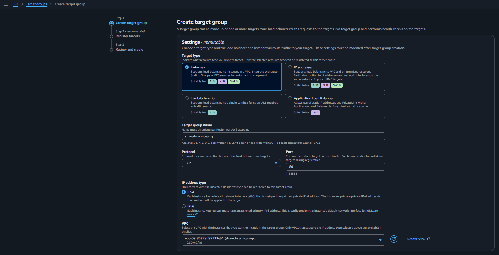

---

### Health Check Configuration

I kept the Target Group health check settings configured to verify that the backend application is responding correctly.

The health check allows AWS to determine whether `shared-services-app` is healthy enough to receive traffic.

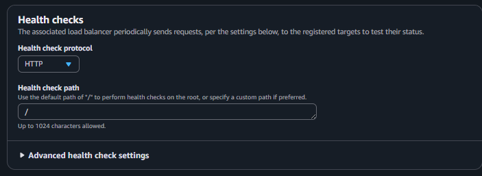

---

### Register the Backend Instance

I registered the private EC2 instance as a backend target.

- **Instance:** `shared-services-app`
- **Port:** `80`

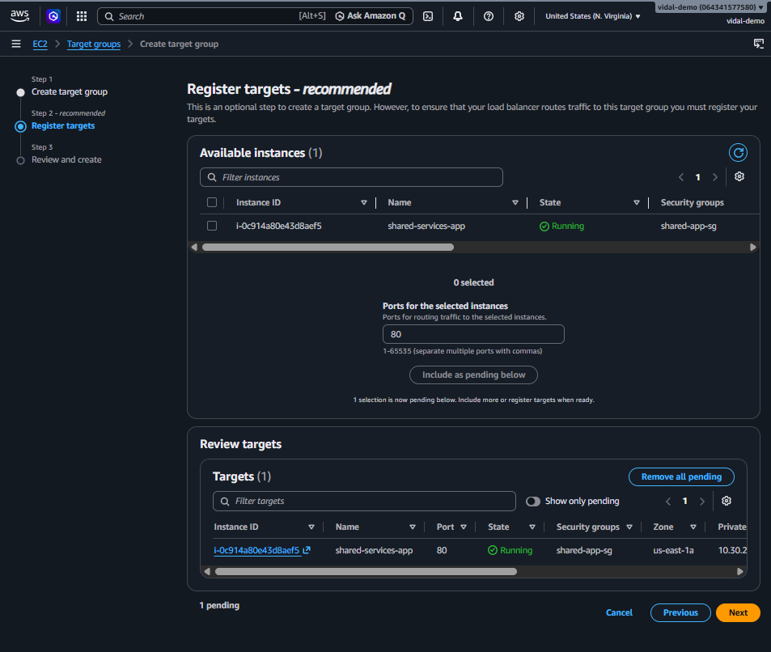

After registering the instance, the Target Group can forward application traffic to Apache running on port `80`.

Once the NLB is attached, the target should eventually report:

```text
Healthy
```


At this point, the backend application is ready to receive traffic from the Network Load Balancer.

---

## Step 2: Create the Internal Network Load Balancer

Next, I created an **internal Network Load Balancer (NLB)**.

The NLB operates at **Layer 4** and forwards TCP traffic to the Target Group.

Because this application must remain private, the load balancer uses the **Internal** scheme instead of being internet-facing.

### Network Load Balancer Configuration

- **Name:** `shared-services-nlb`
- **Scheme:** Internal
- **IP Address Type:** IPv4
- **VPC:** `shared-services-vpc`

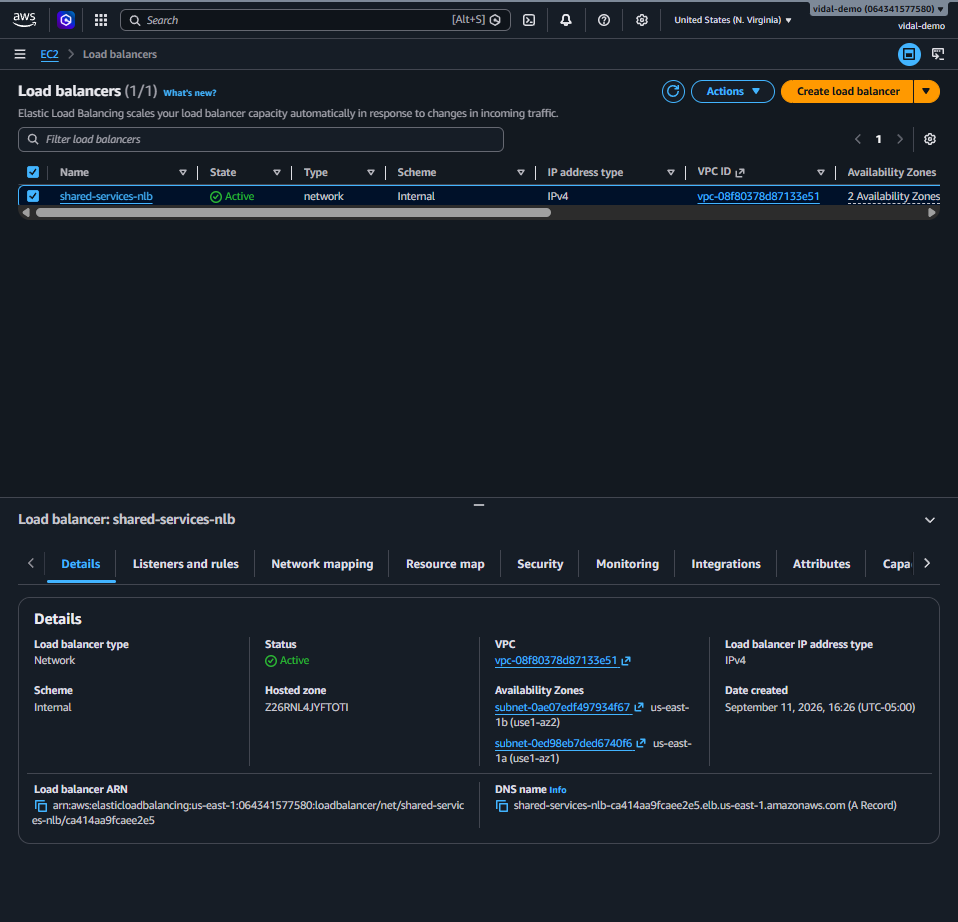

---

### Network Mapping

I associated the NLB with the private subnets inside the Shared Services VPC.

- `shared-private-subnet-1`
- `shared-private-subnet-2`

Using multiple private subnets allows the load balancer to operate across multiple Availability Zones.

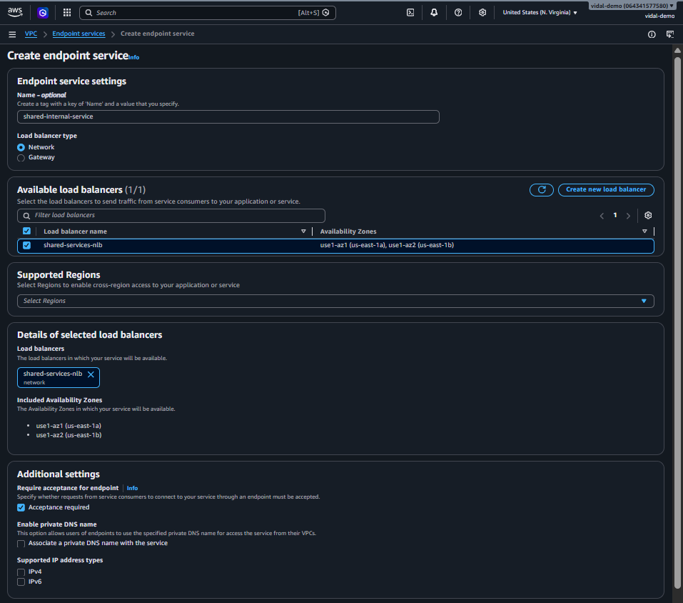

---

### Security Group Configuration

I associated the Network Load Balancer with the Security Group used to control access to the internal service.

- **Security Group:** `shared-nlb-sg`

The backend EC2 instance remains protected by `shared-app-sg`.

This creates a separation between access to the load balancer and access to the application instance.

---

### Listener Configuration

I configured the NLB listener to accept TCP traffic on port `80`.

- **Protocol:** TCP
- **Port:** `80`
- **Forward To:** `shared-services-tg`

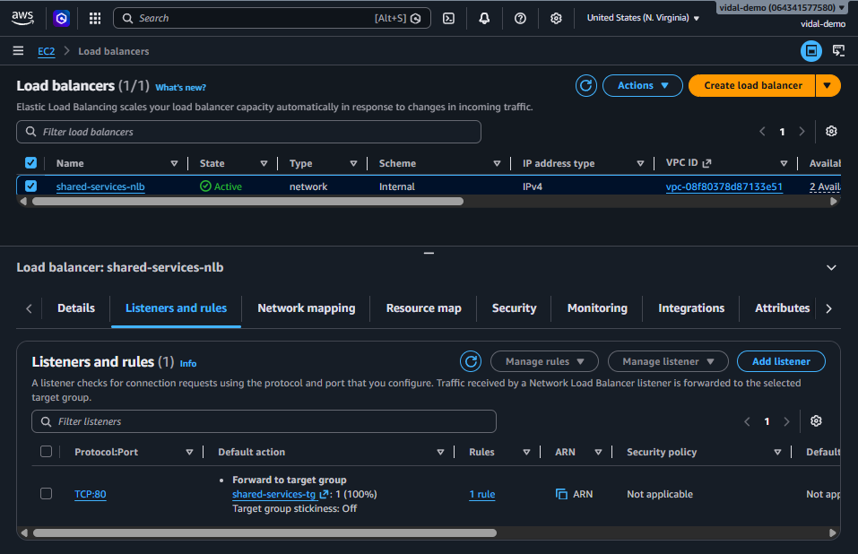

The resulting traffic path is:

```text
Internal NLB
    |
 TCP :80
    |
    v
shared-services-tg
    |
    v
shared-services-app
    |
    v
Apache :80
```

After creating the load balancer, I waited for it to become:

```text
Active
```

and confirmed that the registered EC2 target became:

```text
Healthy
```

---

## Step 3: Create the PrivateLink Endpoint Service

With the internal NLB running, I exposed it through an **AWS PrivateLink Endpoint Service**.

The Endpoint Service acts as the provider-side entry point for approved VPCs that want to consume the Shared Services application.

### Endpoint Service Configuration

I created the PrivateLink Endpoint Service using the internal Network Load Balancer.

- **Name:** `shared-internal-service`
- **Load Balancer Type:** Network Load Balancer
- **Network Load Balancer:** `shared-services-nlb`
- **Supported IP Address Type:** IPv4
- **Acceptance Required:** Enabled
- **State:** Available

Keeping **Require acceptance for endpoint connections** enabled gives me control over which VPCs are allowed to connect to the PrivateLink service.

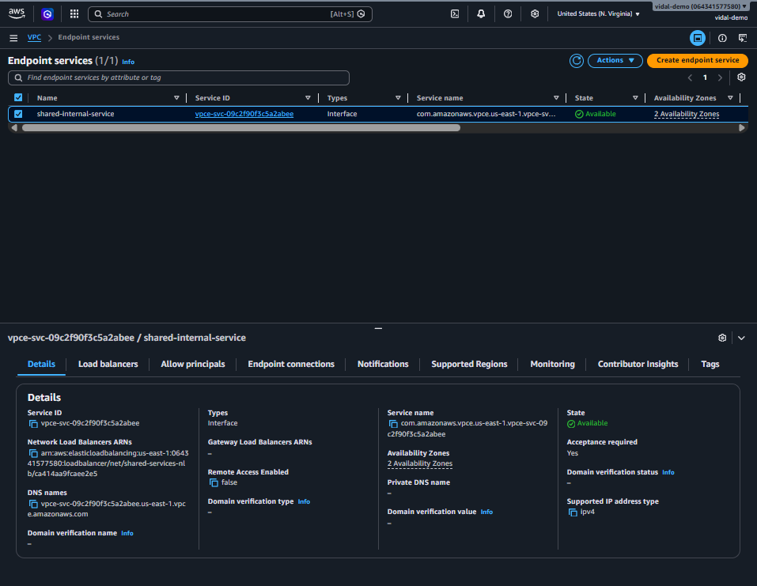

---

## Step 4: Copy the PrivateLink Service Name

After creating the Endpoint Service, AWS generated a unique **Service Name**.

It follows a format similar to:

```text
com.amazonaws.vpce.us-east-1.vpce-svc-xxxxxxxxxxxxxxxxx
```

This service name identifies the PrivateLink provider service.

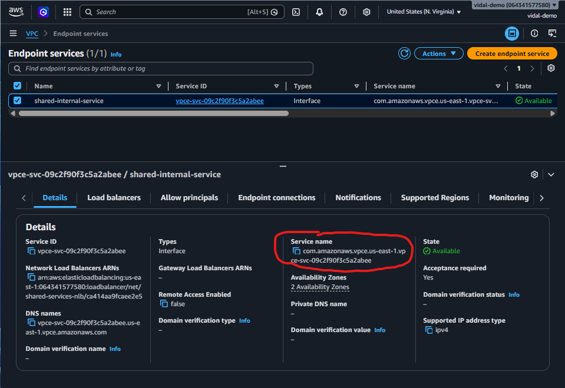

I saved this value because it will be required when creating the Interface Endpoints inside the:

- **Payments VPC**
- **Analytics VPC**

Those VPCs will use this service name to request private connections to the Shared Services application.

---

## Provider-Side Architecture

At the end of this section, the provider side of the architecture looks like this:

```text
PrivateLink Endpoint Service
             |
             v
   shared-services-nlb
       Internal NLB
             |
          TCP :80
             |
             v
    shared-services-tg
             |
             v
   shared-services-app
             |
             v
        Apache :80
```

The application remains entirely private.

There is:

- No public-facing load balancer
- No public IP on the application server
- No direct internet exposure to the backend service
- No VPC peering required for consumers

---

## Expected Result

At the end of this section:

- `shared-services-tg` exists
- `shared-services-app` is registered as a backend target
- The target reports as healthy
- `shared-services-nlb` is running internally
- TCP port `80` forwards to the Target Group
- The NLB is not internet-facing
- `shared-services-endpoint-service` is available
- Endpoint connection acceptance is enabled
- The PrivateLink Service Name has been copied
- The Shared Services VPC is ready to accept PrivateLink consumer connections

---

## Next: Configure the PrivateLink Consumers

The next section will configure the **Payments** and **Analytics** VPCs as PrivateLink consumers.

Each client VPC will receive its own **Interface Endpoint**, allowing it to access the Shared Services application privately without VPC peering or public internet connectivity.

---
